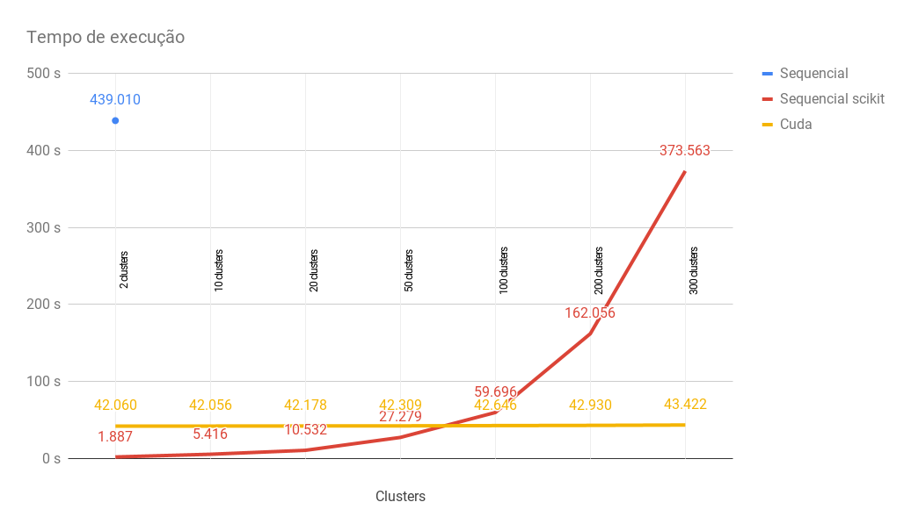
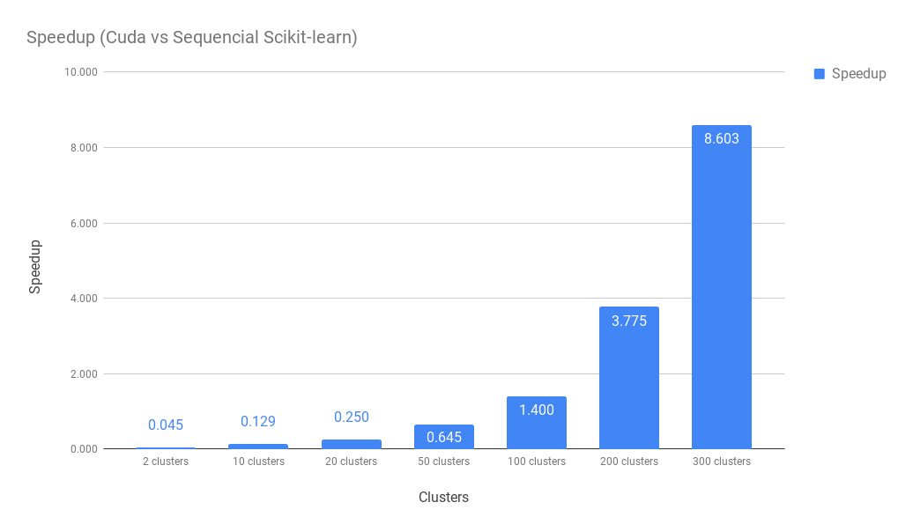

# Algoritmo K-means em CUDA

## Códigos
Kmeans Sequencial: [kmeans.py](./kmeans.py)  
Kmeans Scikit-learn: [kmeans_skl.py](./kmeans_skl.py)  
Kmeans Cuda: [kmeans_cuda.py](./kmeans_cuda.py)

## Resultados
Dataset: Watch Gyroscope  - 3205431 linhas  

|Clusters|2 clusters|10 clusters|20 clusters|50 clusters|100 clusters|200 clusters|300 clusters|
|--------|----------|-----------|-----------|-----------|------------|------------|------------|
|Sequencial|439.010|-|-|-|-|-|-|
|Sequencial scikit|1.887|5.416|10.532|27.279|59.696|162.056|373.563|
|Cuda|42.060|42.056|42.178|42.309|42.646|42.930|43.422|
|Speedup|0.045|0.129|0.250|0.645|1.400|3.775|8.603|

  

  
