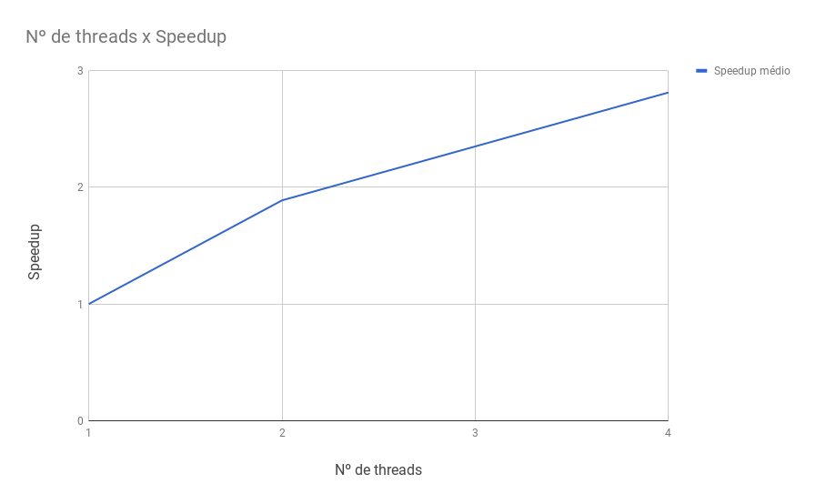
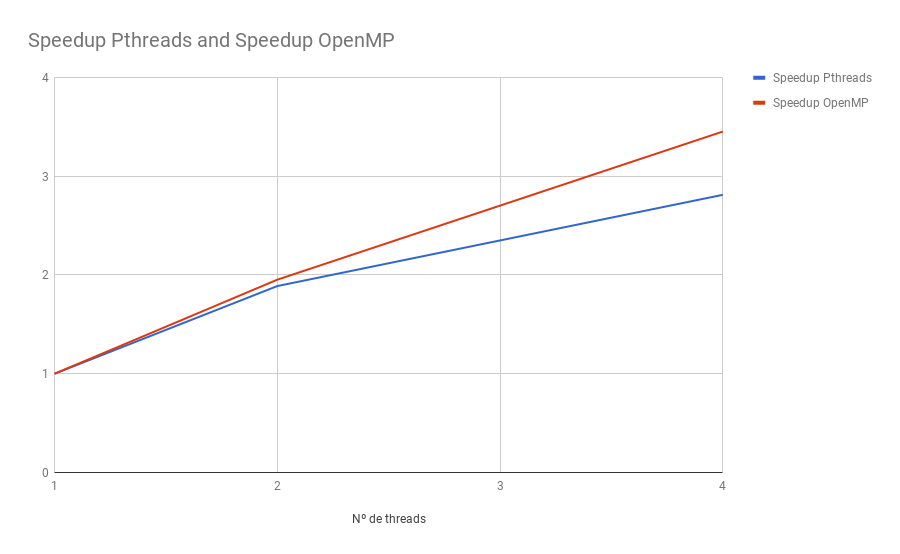
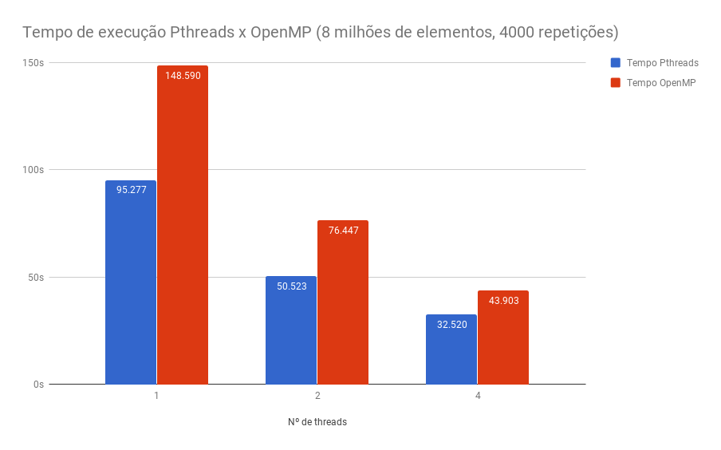

[Programação Paralela](https://github.com/AndreaInfUFSM/elc139-2018a) > T3

# T3: Programação Paralela Multithread
--------------------------------------------------

Nome: Felipe Marin

## Pthreads
1. Explique como se encontram implementadas as 4 etapas de projeto: particionamento, comunicação, aglomeração, mapeamento (use trechos de código para ilustrar a explicação).  
    Os dados utilizados são dois vetores que podem ser particionado por multiplas threads já que cada posição dos vetorres é independente do restante para calcular o produto.  
    A função dotprod_worker responsável por executar os cálculos recebe como argumento o número da thread onde será executada.

    ```
    for (i = 0; i < nthreads; i++) {
        pthread_create(&threads[i], &attr, dotprod_worker, (void *) i);
    }
    ```

    É usado o número da thread para calcular o início e fim do pedaço do vetor usado pela thread, mapeando o cálculo igualmente entre elas.  

    ```
    long offset = (long) arg;
    double *a = dotdata.a;
    double *b = dotdata.b;     
    int wsize = dotdata.wsize;
    int start = offset*wsize;
    int end = start + wsize;
    ```

    A comunicação entre as threads é necessária para adicionar o valor calculado na variável 'dotdata.c', é usado um mutex da biblioteca pthreads para permitir que apenas uma thread acesse a variável de cada vez.  

    ```
    pthread_mutex_lock (&mutexsum);
    dotdata.c += mysum;
    pthread_mutex_unlock (&mutexsum);
    ```

2. Considerando o tempo (em segundos) mostrado na saída do programa, qual foi a aceleração com o uso de threads?  
    Utilizando o vetor de 1000000 de elementos e 2000 repetições os tempos foram:
    * 1 thread = 6 segundos
    * 2 threads = 3 segundos
    * Speedup = 2

3. A aceleração (speedup) se sustenta para outros tamanhos de vetores, números de threads e repetições? Para responder a essa questão, você terá que realizar diversas execuções, variando o tamanho do problema (tamanho dos vetores e número de repetições) e o número de threads (1, 2, 4, 8..., dependendo do número de núcleos). Cada caso deve ser executado várias vezes, para depois calcular-se um tempo de processamento médio para cada caso. Atenção aos fatores que podem interferir na confiabilidade da medição: uso compartilhado do computador, tempos muito pequenos, etc.  

    |Tamanho do vetor|Repetições|Nº de threads|Tempo Médio (segundos)|Speedup|
    |-------|----|-|------|-----|
    |1000000|2000|1|6.166 |1    |
    |1000000|2000|2|3.224 |1.912|
    |1000000|2000|4|2.077 |2.969|
    |1000000|4000|1|12.237|1    |
    |1000000|4000|2|6.439 |1.900|
    |1000000|4000|4|4.335 |2.822|
    |2000000|2000|1|12.427|1    |
    |2000000|2000|2|6.500 |1.911|
    |2000000|2000|4|4.630 |2.683|
    |2000000|4000|1|24.612|1    |
    |2000000|4000|2|12.844|1.916|
    |2000000|4000|4|9.071 |2.713|
    |4000000|2000|1|23.811|1    |
    |4000000|2000|2|13.096|1.818|
    |4000000|2000|4|8.490 |2.804|
    |4000000|4000|1|47.649|1    |
    |4000000|4000|2|25.408|1.875|
    |4000000|4000|4|17.061|2.792|
    |8000000|2000|1|47.167|1    |
    |8000000|2000|2|24.988|1.887|
    |8000000|2000|4|16.913|2.788|
    |8000000|4000|1|95.277|1    |
    |8000000|4000|2|50.523|1.885|
    |8000000|4000|4|32.520|2.929|

    Como pode ser observado com as medições da tabela, o speedup se mantém com diferentes tamanhos de vetor e número de repetições.
    Já o ganho de speedup com o número de threads é menor com um maior número de threads. Usando apenas 2 threads o speedup fica próximo ao valor ideal de 2. Usando 4 threads o speedup ideal seria 4, porém se obteve um speedup médio de 2.813

4. Elabore um gráfico/tabela de aceleração a partir dos dados obtidos no exercício anterior.  
    

5. Explique as diferenças entre [pthreads_dotprod.c](pthreads_dotprod/pthreads_dotprod.c) e [pthreads_dotprod2.c](pthreads_dotprod/pthreads_dotprod2.c). Com as linhas removidas, o programa está correto?  

    ```
    pthread_mutex_lock (&mutexsum);
    dotdata.c += mysum;
    pthread_mutex_unlock (&mutexsum);
    ```

    As linhas removidas são um mutex que serve para evitar que multiplas threads acessem um recurso compartilhado ao mesmo tempo, seu uso evita um problema de condição de corrida. Por exemplo, se a thread 1 ler o valor dotdata.c, e logo em seguida a thread 2 escrever um novo valor na variável, a thread 1 ira somar 'mysum' ao valor antigo (sem a alteração da thread 2) e guardar na variável dotdata.c, causando um resultado incorreto no algoritmo.

## OpenMP
Código OpenMP: [omp_dotprod.c](./openmp/omp_dotprod.c)

|Tamanho do vetor|Repetições|Nº de threads|Tempo Médio (segundos)|Speedup|
|-------|----|-|------|-----|
|1000000|2000|1|9.388 |1    |
|1000000|2000|2|4.735 |1.982|
|1000000|2000|4|2.543 |3.690|
|1000000|4000|1|18.730|1    |
|1000000|4000|2|9.510 |1.96 |
|1000000|4000|4|5.112 |3.66 |
|2000000|2000|1|18.731|1   |
|2000000|2000|2|9.607 |1.949|
|2000000|2000|4|5.612 |3.337|
|2000000|4000|1|37.340|1    |
|2000000|4000|2|19.062|1.958|
|2000000|4000|4|10.890|3.428|
|4000000|2000|1|37.454|1    |
|4000000|2000|2|19.102|1.960|
|4000000|2000|4|10.958|3.417|
|4000000|4000|1|74.741|1    |
|4000000|4000|2|38.174|1.957|
|4000000|4000|4|21.912|3.410|
|8000000|2000|1|74.360|1    |
|8000000|2000|2|39.067|1.903|
|8000000|2000|4|22.519|3.302|
|8000000|4000|1|148.58|1    |
|8000000|4000|2|76.447|1.943|
|8000000|4000|4|43.903|3.384|

### Speedup
O OpenMp apresenta um maior speedup com o aumento no número de threads comparado ao Pthreads:



### Tempo de execução
O tempo de execução do OpenMP é maior que o código implementado com Pthreads:




## Referências
Blaise Barney, Lawrence Livermore National Laboratory. POSIX Threads Programming. [https://computing.llnl.gov/tutorials/pthreads/](https://computing.llnl.gov/tutorials/pthreads/)  
Blaise Barney, Lawrence Livermore National Laboratory. OpenMP Tutorials. [https://computing.llnl.gov/tutorials/openMP/](https://computing.llnl.gov/tutorials/openMP/)  
Macalester College. Vector Add with OpenMP. [http://selkie.macalester.edu/csinparallel/modules/ConceptDataDecomposition/build/html/Decomposition/OpenMP_VecAdd.html](http://selkie.macalester.edu/csinparallel/modules/ConceptDataDecomposition/build/html/Decomposition/OpenMP_VecAdd.html)  